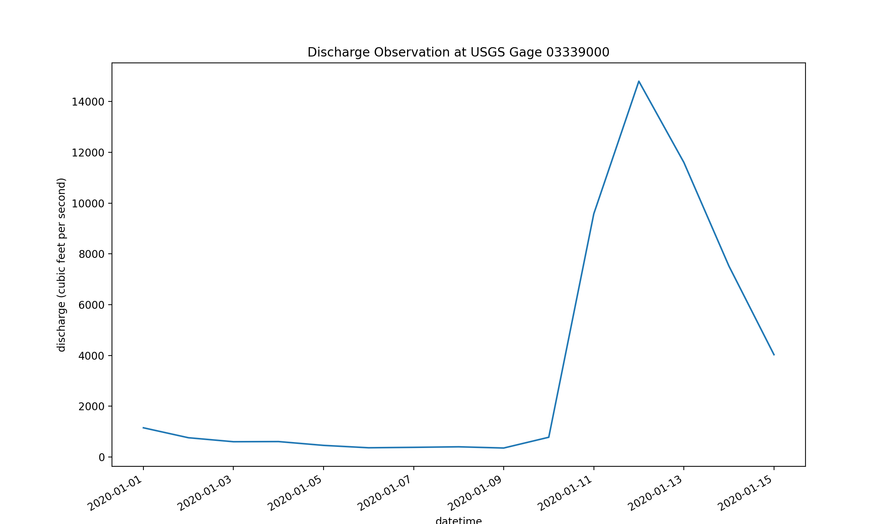

# nwis
[](https://nwis.readthedocs.io/en/latest/?badge=latest)
[](https://github.com/gantian127/nwis/blob/master/LICENSE.txt)
[](https://mybinder.org/v2/gh/gantian127/nwis/master?filepath=notebooks%2Fnwis.ipynb)


Python library to fetch and process the National Water Information System (Nwis) time series datasets. 

If you have any suggestion to improve the current function, please create a github issue 
[here](https://github.com/gantian127/nwis/issues).
## Get Started


#### Install package

**Stable Release**

The nwis package and its dependencies can be installed with pip.
```
$ pip install nwis
```

**From Source**

After downloading the source code, run the following command from top-level folder 
(the one that contains setup.py) to install nwis.
```
$ pip install -e .
```

#### Download NWIS Data
You can launch binder to test and run the code below.

##### Example 1: use Nwis class to download data (Recommended method)

```python
import matplotlib.pyplot as plt
from nwis import Nwis

# get data from NWIS
nwis_data = Nwis()
dataset = nwis_data.get_data(site='03339000', start_date='2020-01-01', end_date='2020-01-15', data_type='dv')

# show site metadata
dataset.attrs

# show variable metadata
for var_name in dataset.data_vars:
    print(dataset[var_name].attrs)
    

# plot discharge data
dataset['00060'].plot(figsize=(12,7))
plt.ylabel('{} ({})'.format(dataset['00060'].variable_name,dataset['00060'].variable_unit))
plt.title('Discharge Observation at USGS Gage 03339000')
```


##### Example 2: use BmiNwis class to download data (Demonstration of how to use BMI)

```python
import matplotlib.pyplot as plt
import numpy as np
import cftime

from nwis import BmiNwis


# initiate a data component
data_comp = BmiNwis()
data_comp.initialize('config_file.yaml')

# get variable info
for var_name in data_comp.get_output_var_names():
    var_unit = data_comp.get_var_units(var_name)
    print(' variable_name: {}\n var_unit: {}\n'.format(var_name, var_unit))

# get time info
start_time = data_comp.get_start_time()
end_time = data_comp.get_end_time()
time_step = data_comp.get_time_step()
time_unit = data_comp.get_time_units()
time_steps = int((end_time - start_time)/time_step) + 1
print(' start_time:{}\n end_time:{}\n time_step:{}\n time_unit:{}\n time_steps:{}\n'.format(start_time, end_time, time_step, time_unit, time_steps))

# initiate numpy arrays to store discharge data
discharge_value = np.empty(1)
discharge_array = np.empty(time_steps)
cftime_array = np.empty(time_steps)

for i in range(0, time_steps):
    data_comp.get_value('discharge', discharge_value)
    discharge_array[i] = discharge_value
    cftime_array[i] = data_comp.get_current_time()
    data_comp.update()

time_array = cftime.num2date(cftime_array, time_unit, only_use_cftime_datetimes=False, only_use_python_datetimes=True)

# plot discharge data
plt.figure(figsize=(9,5))
plt.plot(time_array, discharge_array)
plt.ylabel('{} ({})'.format('discharge', 'cubic feet per second'))
plt.title('Discharge Observation at USGS Gage 03339000')
```

